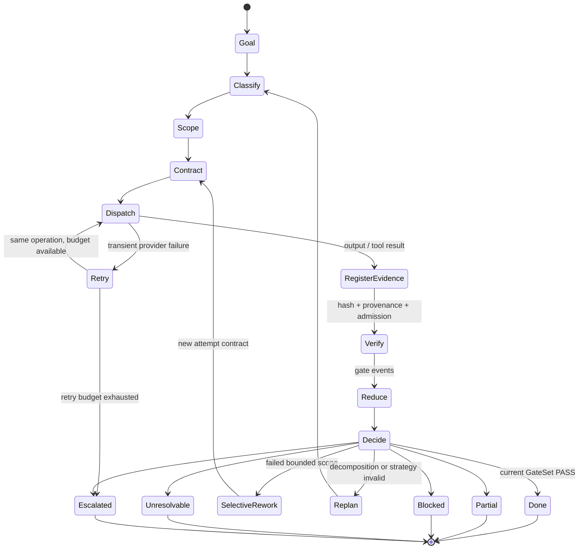

# Контур управления ИИ-агентом: как оркестратор принимает решения и останавливает цикл

ИИ-агент может вернуть убедительный ответ, приложить diff, написать `APPROVE` и сообщить, что задача завершена. Ни один из этих сигналов сам по себе не доказывает завершение. Diff может не проходить тесты, ревью — относиться к предыдущей попытке, а уверенный итог — опираться на непроверенный артефакт. Наблюдаемая проблема здесь не в том, что модель иногда ошибается. Проблема в том, что её output слишком легко принять за выполненное решение.

Опыт локального harness показывает другой критерий качества: не длину автономного пробега, а устройство **control plane**. Чем явнее в системе состояния, контракты, проверки, бюджеты, правила повторной работы и условия остановки, тем меньше оснований путать предложение с решением. Локальный инвариант сформулирован жёстко: «LLM производит предложения и свидетельства; код принимает решения» [UNIFIED_ORCHESTRATION_PRINCIPLES.md](UNIFIED_ORCHESTRATION_PRINCIPLES.md). Это архитектурная позиция данного проекта (`DOCUMENTED POLICY`), а не универсальный стандарт и не запрет использовать модель для рассуждений.

## Два контура вместо одного «умного агента»

Полезно разделить агентную систему на два контура.

**Work plane** выполняет содержательную работу: декомпозирует задачу, пишет код или текст, вызывает инструменты, формулирует гипотезы, собирает наблюдения, предлагает маршрут. Здесь допустима вероятностность: несколько разумных решений могут отличаться.

**Control plane** отвечает на другой класс вопросов: какой контракт действует, допустим ли выбранный маршрут, зарегистрирован ли артефакт, какие gates обязательны для текущей попытки, исчерпан ли бюджет, надо ли повторить операцию, переделать часть результата, перепланировать работу или остановиться. Эти решения должны быть воспроизводимыми и наблюдаемыми.

В локальной code-factory такое разделение не только описано, но и частично обкатано (`IMPLEMENTED/EXERCISED`). Агентские ответы превращаются в evidence-события, а authoritative state вычисляет reducer из append-only истории с hash chain и frozen policy snapshot. Агент не командует переходом состояния напрямую. При повторном проигрывании reducer должен получить ту же проекцию; повреждение цепочки обнаруживается тестами [STATE_REDUCER_ARCHITECTURE.md](STATE_REDUCER_ARCHITECTURE.md), [STAGE2_ATTEMPT_GATESET_STATE_REDUCER_2026-09-06.md](STAGE2_ATTEMPT_GATESET_STATE_REDUCER_2026-09-06.md), [state_reducer.py](scripts/code-factory/state_reducer.py), [test_runtime_core.py](tests/test_runtime_core.py). Это подтверждение для текущего checkout, не заявление о production-поведении за его пределами.

Отсюда следует практическая граница: модель может предложить `DONE`, но только reducer вправе материализовать `DONE`. Модель может назвать артефакт безопасным, но admission определяет policy. Модель может рекомендовать ещё одну попытку, но лимит и тип следующего перехода принадлежат stop controller.

## Реконструированный управляющий цикл

Полный цикл удобно читать как цепочку из девяти операций:

`goal → classify → scope → contract → dispatch → evidence/provenance → verify → reduce → decide`.

Сначала цель разбирается на проверяемые claims. Затем оцениваются риск, необходимые capability и границы воздействия. Из них получается контракт: ожидаемый артефакт, acceptance criteria, разрешённые инструменты, обязательные gates и бюджеты. После dispatch результат не сразу становится фактом выполнения: он регистрируется как артефакт с происхождением, проходит admission и проверки. Только затем события сворачиваются в состояние, а control plane выбирает следующий переход.



Эта диаграмма — **реконструкция из нескольких подсистем**, а не описание одной полностью реализованной executable FSM. В частности, unified `REPLAN`, полный словарь `PARTIAL/UNRESOLVABLE`, цельная ветка NoAgents, текущий `/ship` merge validator и полное live guard wiring не доказаны. Диаграмма полезна как проектная карта: она показывает, где решение должно иметь владельца и где незавершённость нельзя переименовывать в успех.

## Кто чем владеет

Оркестратор нужен не для того, чтобы «быть умнее» worker. Его задача — удерживать распределение полномочий. Компактно оно выглядит так:

| Объект решения | Что может предложить work plane | Чем владеет control plane |
|---|---|---|
| Route | candidate, kind, decomposition | допустимый bucket, profile и execution mode |
| Artifact | реализация, отчёт, observation | schema, hash, origin, admission |
| Gates | findings и рекомендации | required GateSet и typed outcome |
| State | описание прогресса | reducer projection из событий |
| Memory | candidate lesson | promotion/rejection с evidence refs |
| Budget | оценка нужной глубины | фактические лимиты и exhaustion rule |
| Stop | рекомендация продолжить или закончить | retry, rework, replan, block, escalate, finalize |

Роли worker, reviewer, tester и process auditor в проекте разделены контрактами (`DOCUMENTED POLICY`). Worker создаёт артефакт; reviewer оценивает результат, но не исправляет его; tester исполняет проверки; auditor судит о процессе по process metadata. Такое разделение уменьшает self-approval, однако источники не доказывают полную capability-level изоляцию auditor от кода во всём runtime. Нельзя превращать контрактное ограничение в заявление о технической невозможности доступа [CODER_DESIGN_PRINCIPLES.md](CODER_DESIGN_PRINCIPLES.md), [code-factory-process.md](shared/code-factory-process.md), [CONTRACTS.md](references/agent-kirpichik/CONTRACTS.md).

### GateSet before success

В default policy новых code-factory runs обязательны reviewer, tester и auditor gates. Это локальный состав, а не обязательная команда для любой агентной системы. Существенен сам инвариант: `PASSED` возникает лишь тогда, когда все required gates **одной текущей попытки** имеют `PASS`; evidence предыдущей попытки новую не закрывает; `DONE` разрешён только после `PASSED` [state_reducer.py](scripts/code-factory/state_reducer.py), [test_runtime_core.py](tests/test_runtime_core.py), [factory_gate_policy.json](config/factory_gate_policy.json).

Именно здесь обнаружилась первая failure story. Раньше reviewer `APPROVE` мог преждевременно перевести задачу в `PASSED`, хотя tester gate ещё не был получен. Исправление состояло не в более строгом prompt для reviewer, а в переносе правила успеха в reducer. Отсутствующий gate теперь остаётся `PENDING`; молчание не считается одобрением.

### Evidence before verdict

Verdict без доказательного объекта — только текст. В code-factory untrusted artifact должен быть зарегистрирован с hash и provenance, а затем допущен guard; альтернативой служит отдельно хешированный sanitized derivative, связанный с исходником. Неизвестная или недопустимая ссылка на артефакт не должна обновлять gates (`IMPLEMENTED/EXERCISED`) [artifact_provenance_policy.json](config/artifact_provenance_policy.json), [code_factory_runner.py](scripts/code-factory/code_factory_runner.py), [state_reducer.py](scripts/code-factory/state_reducer.py), [test_runtime_core.py](tests/test_runtime_core.py).

Но `Guard PASS` означает только admission по конкретной policy. Это не доказательство истинности содержания и не гарантия полной защиты от prompt injection. Локальная threat model фиксирует semantic, multi-hop, taint-loss и compaction blind spots; сама оценка частично основана на локальных и синтетических данных и признаёт недостаточность для production (`IMPLEMENTED/EXERCISED` с существенными пределами) [guard_policy.json](config/guard_policy.json), [THREAT_MODEL.md](guard/docs/THREAT_MODEL.md), [ARCHITECTURE.md](guard/docs/ARCHITECTURE.md). С терминологией excessive agency это согласуется лишь на уровне направления: OWASP рекомендует минимизировать функции, полномочия и автономию и проверять high-impact actions вне решения самой модели [OWASP LLM06:2025](https://genai.owasp.org/llmrisk/llm062025-excessive-agency/).

## Как выбрать форму оркестрации

Добавление агентов — не автоматическое усиление системы. Локальная эвристика предлагает выбирать минимально достаточную форму по структуре задачи, риску и результатам evals. Похожее терминологическое разделение между workflows и agents использует Anthropic, а OpenAI рекомендует сначала исчерпать возможности single-agent подхода; это сопоставление терминов, не внешнее доказательство эффективности локальной схемы [Building effective agents](https://www.anthropic.com/research/building-effective-agents), [A practical guide to building agents](https://openai.com/business/guides-and-resources/a-practical-guide-to-building-ai-agents/).

| Сигнал задачи | Форма | Обязательная защита |
|---|---|---|
| Один артефакт, одна перспектива | Direct invocation | Schema и acceptance checks по риску |
| Маршрут полностью известен и алгоритмизируем | Deterministic workflow или NoAgents | Validator, tests, policy gate; полная NoAgents-ветка в проекте пока `PROPOSED/BACKLOG` |
| Неопределённость ограничена одной областью ответственности | Single-agent loop | Tool guards, budget, stop controller |
| Подзадачи независимы | Fan-out/fan-in | Контракт на ветвь, отсутствие shared mutable state, explicit merge |
| Один артефакт требует разных типов проверки | Worker–reviewer–tester–auditor | GateSet текущей попытки; конкретный состав ролей зависит от продукта |
| Есть конкурирующие гипотезы, которые должны опровергать друг друга | Adversarial team | Hypothesis ledger и convergence rule; режим platform-dependent и экспериментален |
| Не хватает permission или сохраняется high-impact ambiguity | Human escalation | Revised contract либо explicit approval |

Основание этой таблицы — локальный каталог паттернов и profile-scoped execution modes (`DOCUMENTED POLICY`) [orchestration-patterns.md](shared/orchestration-patterns.md), [execution_modes.json](config/execution_modes.json). У неё нет числовых универсальных порогов.

У fan-out есть дополнительное ограничение. Параллельные ветви безопасно запускать только при отсутствии общей изменяемой памяти и зависимости по порядку. Каждая ветвь возвращает отдельный отчёт, а один явный merge owner сопоставляет claims, evidence и расхождения. Prose summary без provenance — не evidence-aware merge. Хотя каталог приводит `/ship` как пример, текущий non-legacy artifact и отдельный merge validator при проверке не найдены; поэтому «Independent fan-out + explicit merge» остаётся `DOCUMENTED POLICY`, а не обкатанным end-to-end механизмом [orchestration-patterns.md](shared/orchestration-patterns.md), [IMPLEMENTATION_TRACKER.md](IMPLEMENTATION_TRACKER.md).

**Fresh-context challenge** решает другую задачу. Если первая правдоподобная гипотеза начинает диктовать весь поиск, независимые контексты должны не голосовать за похожие ответы, а пытаться опровергнуть альтернативы. Для routine verdict такая команда избыточна; она оправдана, когда взаимодействие гипотез действительно меняет вывод (`DOCUMENTED POLICY`) [orchestration-patterns.md](shared/orchestration-patterns.md).

## Маршрут как компилируемая policy

Routing тоже нельзя оставлять случайным побочным эффектом prompt или порядка условий. Вторая failure story проекта: coarse router выбирал первое regex-совпадение. При пересекающихся правилах порядок строк фактически становился скрытой policy; security-запрос мог уйти в более общий bucket. Исправление вынесло приоритеты в конфигурацию и сохранило в результате candidates, strategy, reason codes и policy hash [DEEP_REVIEW_2026-09-06.md](DEEP_REVIEW_2026-09-06.md).

Текущий router сначала детерминированно разделяет запрос на claims, назначает им kind, bucket и stable ID, затем строит per-claim и grouped execution plan. Это создаёт структурную основу для selective rework и не требует помещать код, исследование и безопасность в один смешанный prompt. Router и compiled snapshot проверяются локальными тестами (`IMPLEMENTED/EXERCISED`), но полный Claim→Audit→Snapshot runtime и end-to-end selective claim repair ещё не собраны [CLAIM_ROUTING_ARCHITECTURE.md](CLAIM_ROUTING_ARCHITECTURE.md), [split_claims.py](scripts/router/split_claims.py), [build_task_plan.py](scripts/router/build_task_plan.py), [resolve_route.py](scripts/router/resolve_route.py), [test_runtime_core.py](tests/test_runtime_core.py).

Смысл compiled routing policy не только в скорости. Snapshot делает выбор маршрута проверяемым: можно установить, какая версия правил действовала, какие кандидаты рассматривались и почему один из них победил. No-match или несовместимый mode должны вести к escalation, а не к импровизированному вызову ближайшего агента. При этом локальная проверка policy hash не доказывает coverage всех live providers.

## Четыре разных способа продолжить работу

Слово «повторить» скрывает разные операции:

1. **Retry** повторяет ту же операцию с тем же смысловым контрактом после transient transport/provider failure или пустого ответа. В локальной документации есть bounded same-prompt ladder, после исчерпания которого управление возвращается пользователю. Конкретные интервалы и число повторов — проектная эвристика; executable controller, обкатывающий в точности эту лестницу, не найден (`DOCUMENTED POLICY`) [dispatch-retry.md](shared/dispatch-retry.md).
2. **Selective rework** создаёт новую попытку только для failed scope. Уже принятые части не следует пересобирать без причины. В code-factory непосредственно обкатаны attempt-local rework и очистка gates для новой попытки, но не полный claim-level ремонт во всех доменах (`IMPLEMENTED/EXERCISED` частично) [state_reducer.py](scripts/code-factory/state_reducer.py), [test_runtime_core.py](tests/test_runtime_core.py).
3. **Replan** меняет декомпозицию, стратегию или маршрут, потому что сигналы показывают ошибочность прежнего плана. Документ динамических эвристик связывает это с process metrics, повторяемостью fixes и остатком бюджета, но unified executable `REPLAN` transition в code-factory не найден (`DOCUMENTED POLICY`, местами `PROPOSED/BACKLOG`) [DYNAMIC_HEURISTICS.md](DYNAMIC_HEURISTICS.md).
4. **Escalation** передаёт нерешённое решение auditor или человеку: например, при permission gap, устойчивом расхождении либо неоднозначном high-impact действии. Tribunal trigger после повторных review failures обкатан, но его локальные thresholds нельзя универсализировать [code-orchestrator.md](agents/code-orchestrator.md), [state_reducer.py](scripts/code-factory/state_reducer.py), [test_runtime_core.py](tests/test_runtime_core.py).

Упрощённый control loop может выглядеть так:

```text
state = reducer.replay(event_log, frozen_policy)

while not state.terminal:
    contract = compile_contract(goal, claims, risk, capabilities, state)
    route = resolve_route(contract, policy_snapshot)
    if route.invalid_or_unavailable:
        return ESCALATED(reason=route.reason)

    result = dispatch(route, contract)
    if result.transient_failure:
        if retry_budget.available_for_same_operation():
            continue  # RETRY: контракт не меняется
        return BLOCKED(reason="dispatch_retry_exhausted")

    artifact = register_hash_and_provenance(result)
    admission = guard(artifact)
    events = verify_current_attempt(artifact, admission, contract.gates)
    state = reducer.apply(events)

    if state.gates_all_pass:
        return DONE
    if state.no_progress:
        return ESCALATED(reason="no_progress")
    if state.failed_scope_is_bounded:
        goal = selective_rework(state.failed_scope)
    elif state.plan_invalid:
        goal = replan(goal, state.process_signals)
    elif state.budget_exhausted:
        return typed_non_success(state.reason)
```

Псевдокод намеренно не фиксирует формулу `attempt_limit`. Здесь есть реальное противоречие: Stage-2 docs и config говорят, что лимит включает initial attempt, тогда как runtime и тест допускают `N` worker reworks после initial. Нельзя выбирать intended semantics без решения владельца контракта или публиковать точное правило как согласованное [STAGE2_ATTEMPT_GATESET_STATE_REDUCER_2026-09-06.md](STAGE2_ATTEMPT_GATESET_STATE_REDUCER_2026-09-06.md), [factory_gate_policy.json](config/factory_gate_policy.json), [state_reducer.py](scripts/code-factory/state_reducer.py), [test_runtime_core.py](tests/test_runtime_core.py).

Отдельный переносимый паттерн — **No-progress cut-off**. В writer-core детерминированный repair loop сравнивает артефакт до и после исправления и завершает цикл с `no_progress`, если текст не изменился, не дожидаясь номинального iteration limit (`IMPLEMENTED/EXERCISED`) [factory_process.py](scripts/writer-core/writer_core/factory_process.py), [test_runtime_boundary.py](scripts/writer-core/tests/test_runtime_boundary.py). Но аналогичный semantic detector в inspected code-factory не найден. Это кандидат на перенос дизайна, а не уже общая возможность harness.

## Остановка должна быть честной и типизированной

Timeout, budget exhaustion и отсутствие capability — не разновидности успеха. Policy требует различать как минимум успешное завершение, `PARTIAL`, `BLOCKED` и `UNRESOLVABLE`. Однако inspected code-factory reducer реализует только часть целевого словаря: в нём есть `DONE`, `FAILED`, `BLOCKED`, `AMBIGUOUS`, но нет `PARTIAL` и `UNRESOLVABLE`. Поэтому Typed stop semantics здесь имеет статус `PROPOSED/BACKLOG`, а не завершённой функции [UNIFIED_ORCHESTRATION_PRINCIPLES.md](UNIFIED_ORCHESTRATION_PRINCIPLES.md), [state_reducer.py](scripts/code-factory/state_reducer.py), [IMPLEMENTATION_TRACKER.md](IMPLEMENTATION_TRACKER.md).

Тип остановки нужен не для красоты API. Он отвечает на разные вопросы следующего уровня. `PARTIAL` позволяет использовать подтверждённую часть результата, не маскируя пробелы. `BLOCKED` сообщает, что продолжение возможно после внешнего изменения — permission, dependency, budget. `UNRESOLVABLE` означает, что доступными средствами условие не разрешается. `ESCALATED` фиксирует передачу решения. Если все эти случаи свести к `DONE` или общему `FAILED`, downstream-система не сможет безопасно решить, что переиспользовать и что делать дальше.

Третья failure story показывает, почему control plane обязан контролировать даже банальные единицы. Timeout в миллисекундах был передан API, ожидающему секунды; защитное ограничение превратилось почти в пятидесятичасовое ожидание. Исправление — явная конверсия единиц [DEEP_REVIEW_2026-09-06.md](DEEP_REVIEW_2026-09-06.md). Это не «ошибка ИИ», а дефект контракта между компонентами. Бюджет, заданный числом без единицы и владельца, не является бюджетом.

## Нить выполнения и память — не одно и то же

Долгий prompt history кажется памятью, но плохо подходит на роль состояния. Локальный **Thread ritual** перед декомпозицией и перед закрытием восстанавливает snapshot из kanban, tracker, technical debt, L3 memory, factory state и portal docs. Его цель — вернуть архитектурную нить после локального погружения; при повторных ревью одного модуля предусмотрен reset с перечитыванием snapshot (`IMPLEMENTED/EXERCISED`) [orchestration-thread-process.md](shared/orchestration-thread-process.md), [code-orchestrator.md](agents/code-orchestrator.md). Скрипт в локальном наблюдении потребовал UTF-8 на Windows после ошибки с default encoding. Причинный эффект ритуала на качество не измерялся.

Четвёртая failure story — re-review с передачей всей истории вместо текущего модуля, последнего diff и unresolved findings. В одном локальном случае контекст разросся до **293k tokens**. После этого правило изменили на delta-only re-review [code-orchestrator.md](agents/code-orchestrator.md). Это единичное наблюдение проекта, не benchmark, не типичный размер и не основание для общего количественного порога.

Long-term memory имеет ещё более узкую роль. По локальной policy она хранит отобранные ретроспективные lessons и routing hints, но не authoritative status, не stop decisions и не «истину» claim без evidence graph. Promotion в L3 требует evidence refs и reason codes; текущий state всё равно восстанавливается из event log (`IMPLEMENTED/EXERCISED`) [MEMORY_POLICY.md](MEMORY_POLICY.md), [IMPLEMENTATION_TRACKER.md](IMPLEMENTATION_TRACKER.md), [code_factory_runner.py](scripts/code-factory/code_factory_runner.py). Формула короткая: **memory is projection, not authority**.

## Неустранимые одним принципом trade-offs

У control plane нет единственной правильной настройки.

- **User-driven против bounded autonomous orchestration.** Каталог паттернов предпочитает явные пользовательские checkpoints и короткие команды; code-orchestrator, напротив, описывает автономную декомпозицию и dispatch. Выбор зависит от обратимости действий, риска и цены потери контекста [orchestration-patterns.md](shared/orchestration-patterns.md), [code-orchestrator.md](agents/code-orchestrator.md).
- **Fail-closed против optimistic checks.** Локальная guard policy блокирует неизвестное происхождение, timeout и classifier error. OpenAI Agents SDK описывает optimistic execution, при котором основной output и guardrail могут вычисляться параллельно. Это разные latency/risk profiles, а не спор, решаемый лозунгом [guard_policy.json](config/guard_policy.json), [OpenAI guide](https://openai.com/business/guides-and-resources/a-practical-guide-to-building-ai-agents/).
- **Fixed safety dependencies против adaptive decision points.** Provenance, permission и обязательные gates разумно фиксировать. Гранулярность декомпозиции или глубину исследования можно адаптировать по сигналам — если сами эвристики версионируются и проверяются [DYNAMIC_HEURISTICS.md](DYNAMIC_HEURISTICS.md).
- **End-state evaluation против trajectory invariants.** Хороший финальный артефакт не доказывает корректность пути, особенно при side effects. Но идеальная process trace не заменяет проверку результата. Нужны и acceptance финального состояния, и инварианты траектории там, где промежуточное действие необратимо.

Эти напряжения в репозитории не сведены в одну ADR и не должны сглаживаться в универсальный best practice (`DOCUMENTED POLICY`).

## Практические правила проектирования

1. **Запретите output напрямую менять authoritative state.** Сначала типизированное событие, schema validation и provenance; затем reducer.
2. **Определяйте успех через GateSet текущей попытки.** Missing, stale и silent gate — не `PASS`. Состав gates выбирайте по риску, а не копируйте из чужой системы.
3. **Компилируйте policy.** Route priorities, compatible modes, budgets и stop conditions должны иметь версию, hash и reason codes. Не позволяйте порядку regex стать архитектурным решением.
4. **Разведите admission и truth.** Guard решает, можно ли использовать объект в данном контуре доверия; проверка фактов и acceptance решают другие задачи.
5. **Не называйте всё retry.** Transport retry сохраняет контракт; selective rework сужает дефектный scope; replan меняет стратегию; escalation меняет владельца решения.
6. **Ограничивайте не только число итераций, но и отсутствие прогресса.** Если артефакт не меняется или повторяется тот же класс дефекта, остановите цикл раньше бюджета.
7. **Типизируйте неуспех.** `BLOCKED`, `PARTIAL`, `UNRESOLVABLE` и `ESCALATED` должны иметь разные downstream semantics. Не документируйте состояние как реализованное, пока reducer его не испускает.
8. **Параллельте только независимое.** У каждой ветви должен быть собственный контракт, у merge — один владелец, а расхождения должны сохраняться до решения.
9. **Восстанавливайте нить snapshot-ом, а не бесконечной историей.** Для re-review передавайте delta и unresolved findings; память используйте как проверенную проекцию прошлого.
10. **Тестируйте control plane отдельно от качества модели.** Нужны тесты на stale evidence, missing gates, повреждение event chain, несовместимый route, budget exhaustion, no progress и честную остановку.

Качество агента проявляется не в том, как долго он способен продолжать работу, а в том, насколько система умеет отказать его output в статусе решения. Оркестратор полезен тогда, когда каждый переход объясним, каждая попытка ограничена, а остановка сообщает именно то, что произошло, — без превращения незавершённости в успех.

## Локальные источники и статус доказательств

Исследовательский пакет проверен по состоянию checkout на 12 сентября 2026 года. Статусы в статье означают следующее:

- **IMPLEMENTED/EXERCISED** — механизм найден в runtime/config и поддержан локальными тестами или наблюдаемым запуском; это не равнозначно production validation.
- **DOCUMENTED POLICY** — правило явно записано в архитектурных документах или agent contracts, но end-to-end исполнение подтверждено не полностью.
- **PROPOSED/BACKLOG** — целевая семантика или ветка описана, однако её полная реализация не доказана.

Основные источники: [UNIFIED_ORCHESTRATION_PRINCIPLES.md](UNIFIED_ORCHESTRATION_PRINCIPLES.md), [STATE_REDUCER_ARCHITECTURE.md](STATE_REDUCER_ARCHITECTURE.md), [STAGE2_ATTEMPT_GATESET_STATE_REDUCER_2026-09-06.md](STAGE2_ATTEMPT_GATESET_STATE_REDUCER_2026-09-06.md), [CLAIM_ROUTING_ARCHITECTURE.md](CLAIM_ROUTING_ARCHITECTURE.md), [MEMORY_POLICY.md](MEMORY_POLICY.md), [DYNAMIC_HEURISTICS.md](DYNAMIC_HEURISTICS.md), [DEEP_REVIEW_2026-09-06.md](DEEP_REVIEW_2026-09-06.md), [orchestration-patterns.md](shared/orchestration-patterns.md), [orchestration-thread-process.md](shared/orchestration-thread-process.md), [dispatch-retry.md](shared/dispatch-retry.md), [state_reducer.py](scripts/code-factory/state_reducer.py), [code_factory_runner.py](scripts/code-factory/code_factory_runner.py), [test_runtime_core.py](tests/test_runtime_core.py), [THREAT_MODEL.md](guard/docs/THREAT_MODEL.md) и [ARCHITECTURE.md](guard/docs/ARCHITECTURE.md).

Открытые ограничения: не доказаны единая executable FSM `goal→decide`, unified `REPLAN`, полный словарь terminal states, full NoAgents branch, current `/ship` merge validator и полное live guard wiring. Семантика `attempt_limit` остаётся противоречивой между docs/config и runtime tests.
