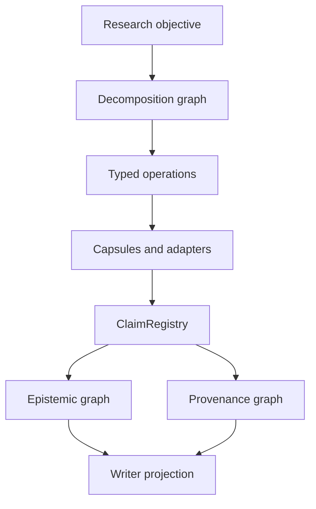
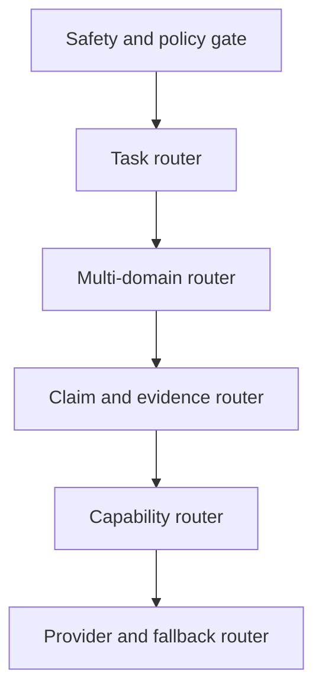

# Мультидисциплинарный Researcher OSINT

## Расширенная архитектурная спецификация claim-centric агента, иерархической маршрутизации и графов знаний

**Статус:** проектная спецификация для реализации  
**Версия:** 0.9  
**Дата среза источников:** 2026-08-28  
**Базовая архитектура:** `Researcher Core / Hermes`  
**Нормативные слова:** `MUST`, `SHOULD`, `MAY` используются в смысле RFC 2119  

---

## 1. Назначение и границы

Этот документ развивает текущую архитектуру `Researcher Core / Hermes` в проект современного исследовательского агента, способного работать с открытыми источниками, локальными корпусами и научной литературой в разных дисциплинах: от физики конденсированного состояния и микробиологии до психиатрии, философии и истории.

Цель — не собрать ещё один «умный чат с поиском», а задать реализуемую систему, в которой:

- исследовательский вопрос декомпозируется в ограниченное дерево подзадач;
- текст разбирается на проверяемые клаймы, но исходный смысл не теряется;
- источники и точные фрагменты доказательств разделены;
- дисциплинарные правила подключаются типизированными капсулами;
- маршрутизаторы только предлагают операции, а не меняют знание;
- каждый вывод имеет происхождение, область применимости и статус проверки;
- глубина исследования увеличивается адаптивно, обычно от 5 до 10 уровней;
- финальный Writer пишет только из разрешённой проекции графа.

Документ опирается на существующие проектные инварианты:

> LLM предлагает семантические изменения. Код принимает, отклоняет, валидирует и хранит состояние.

Он не заменяет базовые спецификации контрактов, транзакций и миграции. Здесь зафиксирован следующий слой: мультидисциплинарность, атомизация клаймов, иерархическое исследование, выбор внешних решений и подробный путь реализации.

### 1.1 Что система должна уметь

Система MUST поддерживать как минимум шесть классов задач:

1. фактологическая проверка конкретного утверждения;
2. обзор состояния вопроса с конкурирующими позициями;
3. систематизированный обзор литературы по протоколу;
4. причинный, механистический или количественный анализ;
5. реконструкция аргумента, события или историографического спора;
6. построение воспроизводимого исследовательского досье с явными пробелами.

### 1.2 Что система не обещает

Система не является:

- автономным научным авторитетом;
- диагностической или лечебной системой;
- доказательством истинности только на основании согласия LLM;
- универсальной онтологией всех дисциплин;
- заменой экспертной оценки, лабораторного эксперимента, архивной критики или систематического обзора;
- оправданием для бесконечного поиска.

### 1.3 О границах этого исследования

Ни один обзор GitHub и литературы не может буквально охватить «всё». Поэтому применён воспроизводимый engineering-scan: первичные репозитории, их документация, статьи авторов, отдельные реализации внутри проектов, известные ограничения и пригодность к текущим инвариантам. Маркетинговые заявления README не считаются доказанной успешностью без статьи, воспроизводимого benchmark-а или зрелого применения.

---

## 2. Итоговое архитектурное решение

Ядро остаётся скучным и кондовым:

- Python 3.12;
- один процесс и CLI-first на первом рабочем срезе;
- синхронный чистый домен, `async` только на I/O-периферии;
- SQLite как authoritative store;
- materialized state + append-only events + transactional outbox;
- `ClaimRegistry` как единственная application write boundary;
- JSON Schema/Pydantic на границах, dataclass/value objects внутри домена;
- явные команды, события, reason codes и версии контрактов;
- внешние фреймворки — только за anti-corruption adapters.

Новая часть архитектуры состоит из пяти раздельных моделей:

1. **Research Decomposition Graph** — что и в какой последовательности исследовать;
2. **Epistemic Graph** — какие клаймы, evidence, gaps и conflicts известны;
3. **Domain Concept Graph** — как устроены термины и отношения конкретной дисциплины;
4. **Corpus Abstraction Graph** — как быстро находить материал на разных уровнях детализации;
5. **Execution / Provenance Graph** — какие операции, модели и данные привели к результату.

Дополнительные проекции — citation graph, argument graph и temporal event graph — строятся из этих моделей, но не становятся вторым источником истины.



Главная инженерная формула:

```text
bounded decomposition
  + typed capsules
  + claim/evidence graph
  + discipline profiles
  + deterministic admission and validation
  + auditable iterative deepening
  = Researcher OSINT
```

---

## 3. Как оценивались внешние решения

### 3.1 Единица заимствования

Единицей анализа был не только пакет, но и **atomic solution** — небольшой переносимый механизм с понятным входом, выходом и критерием проверки. Примеры:

- `selection → disambiguation → decomposition` у Claimify;
- фильтрация неверифицируемых утверждений у VeriScore;
- `claim triplets` у RefChecker;
- contextual summarization после retrieval у PaperQA2;
- решётка перспектив и диалог follow-up у STORM;
- community summaries и map-reduce global query у GraphRAG;
- Personalized PageRank по графу фактов у HippoRAG;
- task ledger и progress ledger у Magentic-One;
- checkpoint на границе шага у LangGraph;
- наследуемый provenance у QIIME 2.

Такой приём можно реализовать локально, измерить и заменить без передачи внешнему проекту права управлять состоянием.

### 3.2 Шкала зрелости

| Уровень | Основание | Разрешённое применение |
|---|---|---|
| A | peer-reviewed работа, открытый код, воспроизводимый benchmark и эксплуатационный опыт | кандидат в production adapter или нормативный pattern |
| B | статья/preprint и открытый код, но ограниченная независимая проверка | экспериментальная капсула за feature flag |
| C | полезный код/README без достаточной оценки | источник отдельных идей и fixtures |
| D | неофициальная или ранняя реализация | только исследовательский прототип |

Звёзды GitHub, громкость анонса и число агентов не повышают этот уровень автоматически.

### 3.3 Критерии интеграции

Каждый кандидат оценивается по следующим вопросам:

```text
Есть ли явная схема входа/выхода?
Можно ли повторить операцию идемпотентно?
Сохраняется ли исходный span и provenance?
Можно ли отключить LLM и протестировать детерминированную часть?
Есть ли benchmark, golden fixtures и отрицательные примеры?
Как обрабатываются scope, отрицание, модальность и числа?
Можно ли встроить механизм как capsule, не отдав ему запись в graph?
Какова цена отказа, обновления и удаления зависимости?
```

### 3.4 Фактически выполненные итерации поиска

Обзор выполнялся не одним широким запросом, а последовательным сужением. Это важно: поиск только по слову `research agent` почти неизбежно находит оболочки и демонстрации, но плохо выявляет работающие внутренние механизмы.

| Итерация | Исследовательский вопрос | Что добавилось в архитектуру |
|---:|---|---|
| 1 | Какие open-source research agents задают общий workflow? | PaperQA2, STORM, GPT Researcher, Open Deep Research, OpenScholar, Agent Laboratory |
| 2 | Как они представляют и проверяют утверждения? | FActScore, SAFE, VeriScore, RefChecker, FacTool, SciFact, RAGChecker, Claimify |
| 3 | Как реализованы multi-hop и hierarchical retrieval? | GraphRAG, LightRAG, HippoRAG, RAPTOR; разделение truth graph и retrieval projection |
| 4 | Как runtime переживает stall, crash и неоднозначный routing? | LangGraph checkpoints, Magentic-One ledgers, Semantic Router thresholds, bounded tree search |
| 5 | Где ломаются parsing и provenance? | Docling/GROBID/Marker ensemble, coordinate alignment, W3C PROV/RO-Crate, QIIME 2 provenance pattern |
| 6 | Какие схемы обязательны в разных дисциплинах? | PICO/RoB/GRADE; material conditions; MIxS/taxonomy; argument/event/source-criticism profiles |
| 7 | Какие решения можно встроить без нарушения текущего ядра? | capsule/adapter matrix, anti-corruption boundaries, phased roadmap |

В каждой итерации применялась одна и та же проверка:

```text
README claim
  -> paper/documentation
  -> implementation detail
  -> known issue or boundary
  -> smallest reusable mechanism
  -> local contract
  -> testable adoption decision
```

Это и есть минимизация по глубине: переходить на следующий уровень только тогда, когда предыдущий уровень не отвечает, **почему** механизм работает и **какое состояние** он меняет.

### 3.5 Реестр ключевых выводов обзора

| ID | Атомарный вывод | Основание | Ограничение | Решение проекта |
|---|---|---|---|---|
| R-01 | Декомпозиция long-form текста делает factuality проверяемой на уровне отдельных утверждений | FActScore, SAFE, VeriScore, RefChecker | качество decomposition само является отдельной ошибкоопасной задачей | staged extractor + отдельные decomposition evals |
| R-02 | Не весь содержательный текст верифицируем как true/false claim | VeriScore, Claimify | interpretation, recommendations и риторика требуют других типов | verifiability status и typed claims |
| R-03 | Triplet удобен для проверки и KG, но недостаточен как полная семантика | RefChecker, Biolink, property-graph extractors | scope/modality/method могут исчезнуть | triplet только как projection |
| R-04 | Query-conditioned summarization улучшает полезность найденных chunks для ответа | PaperQA2 RCS | summary может исказить span и дорого стоит | derivative note с обязательной ссылкой на span |
| R-05 | Решётка перспектив повышает широту вопросов до написания | STORM/Co-STORM | persona не доказывает релевантность или полноту | perspective proposals + gap coverage tests |
| R-06 | Иерархические summaries и communities полезны для глобальных вопросов по корпусу | RAPTOR, GraphRAG | индексация/глобальный query дороги; summary не evidence | optional Corpus Abstraction Graph |
| R-07 | Fact/entity graph и PPR полезны для candidate expansion в multi-hop задачах | HippoRAG | OpenIE добавляет шум, центральность не равна истинности | bounded PPR с trace и downstream validation |
| R-08 | Durable execution требует checkpoint boundaries и идемпотентных side effects | LangGraph и общие workflow patterns | framework checkpoint не совпадает с epistemic snapshot | собственные SQLite transactions; framework later adapter |
| R-09 | План задачи и оценка прогресса должны быть разными состояниями | Magentic-One | LLM ledger может ошибаться | ledgers materialized из authoritative events |
| R-10 | Semantic routing полезен как дешёвый классификатор маршрута | Semantic Router | threshold зависит от route/data; similarity не confidence | после deterministic gates, с per-route calibration |
| R-11 | Научный PDF требует сочетания parser-ов и проверки координат | Docling, GROBID, Marker и их issue histories | ни один parser не безошибочен на reading order/tables/formulas | parser ensemble + ParseConflict |
| R-12 | Междисциплинарность достигается не общим prompt, а разными evidence contracts | PICO/MIxS/Biolink/materials/argument/history ecosystems | онтологии неполны и меняются | versioned DomainProfiles |
| R-13 | Active learning уменьшает ручной screening, но не отменяет протокол и человека | ASReview | stopping criterion и bias остаются частью обзора | prioritizer capsule, human labels, logged decisions |
| R-14 | Provenance должен наследоваться артефактами и переживать экспорт | QIIME 2, PROV-O, RO-Crate | экспортная модель не обязана быть внутренней схемой | local provenance graph + standard exports |

Колонка «решение проекта» является архитектурным выводом, а не фактом из внешнего проекта. Именно такие выводы должны оформляться ADR при реализации.

---

## 4. Клайм как центральная, но не единственная единица знания

### 4.1 Почему «атомарный факт» недостаточен

FActScore, SAFE, VeriScore, RefChecker и сходные системы убедительно показывают полезность декомпозиции длинного ответа в небольшие проверяемые утверждения. Но атомарный факт — это оценочная проекция текста, а не универсальная научная онтология.

Тройка `subject–predicate–object` хорошо подходит для части биомедицинских связей, но теряет:

- условие эксперимента;
- метод измерения;
- популяцию и comparator;
- неопределённость и статистическую модель;
- модальность и отрицание;
- временной интервал;
- авторскую или историографическую позицию;
- разницу между наблюдением и интерпретацией;
- зависимость составного эффекта от нескольких факторов.

Поэтому authoritative объект — **контекстно полный PropositionClaim**, а triplet, PICO, event frame и argument role — его проверяемые проекции.

### 4.2 Процесс атомизации

Claim Extraction Capsule MUST реализовать четыре явных стадии:

1. **Selection** — найти check-worthy/verifiable proposition; мнения, риторика и инструкции пометить отдельно.
2. **Disambiguation** — раскрыть местоимения, сокращения и эллипсис только из доступного контекста. Любое добавленное толкование сохранить как `ResolutionProposal`.
3. **Decomposition** — разделить независимые пропозиции, не разрушая необходимые сравнительные, причинные и интеракционные отношения.
4. **Projection** — создать domain-specific views без потери исходной формулировки.

```text
SourceSpan
  -> ClaimCandidate
  -> ResolutionProposal
  -> AtomicClaimProposal(s)
  -> ClaimAssemblyProposal
  -> Admission validators
  -> Claim + projections
```

### 4.3 Правило минимальной семантической полноты

Клайм считается достаточно атомарным, если:

- его можно независимо связать с evidence;
- verdict по нему не обязан совпадать с verdict по соседней части предложения;
- все обязательные ограничения для проверки присутствуют в `Scope`;
- дальнейшее деление разрушает сравнение, причинную конструкцию, условие или определяемое отношение.

Пример:

```text
«В образцах FeSe при давлении 6 GPa температура перехода выше,
чем при атмосферном давлении»
```

Нельзя оставлять только `FeSe — имеет — высокую Tc`. Нужны material, phase/sample, pressure, comparator, property, unit и measurement context.

### 4.4 Набор проекций

| Проекция | Для чего | Статус |
|---|---|---|
| Proposition view | полное проверяемое утверждение | authoritative text semantics |
| Triplet view | KG retrieval и entity linking | derived projection |
| Quantity view | значения, единицы, погрешности, сравнения | controlled object |
| Event view | события, участники, время, место | derived projection |
| PICO/PECO view | клиническая/эпидемиологическая постановка | domain projection |
| Argument view | premise, conclusion, support, attack, undercut | domain projection |
| Method view | design, instrument, protocol, model | domain projection |

Проекция MUST иметь `projection_of`, версию extractor-а и список неразрешённых полей. Нельзя молча заменять исходный proposition проекцией.

### 4.5 Базовый контракт Claim

```python
class Claim:
    id: ClaimId
    proposition: str
    claim_kind: ClaimKind
    scope_id: ScopeId
    modality: Modality
    polarity: Polarity
    quantifier: Quantifier | None
    status: ClaimStatus
    source_span_ref: EvidenceSpanRef | None
    created_by: ActorRef
    created_at: datetime
    revision: int
```

`claim_kind` SHOULD включать:

```text
OBSERVATIONAL
EXPERIMENTAL_RESULT
QUANTITATIVE
CAUSAL
MECHANISTIC
DEFINITIONAL
TAXONOMIC
COMPUTATIONAL
METHODOLOGICAL
HISTORICAL_EVENT
ATTRIBUTION
INTERPRETIVE
ARGUMENTATIVE
NORMATIVE
DIAGNOSTIC_OR_CLINICAL
RECOMMENDATION
```

### 4.6 Scope как многомерный объект

`Scope` не строковый тег. Он MUST позволять выразить:

```text
domain and subdomain
population / organism / material system
time interval and validity time
location / environment / jurisdiction
experimental or observational conditions
intervention / exposure / comparator
measurement method and outcome
edition / translation / archival collection
diagnostic framework and cultural context
assumptions and exclusions
```

Сравнение scope производится по измерениям. `scope_match=MATCH|PARTIAL|MAJOR_SHIFT|UNKNOWN` хранится на relation `Evidence → Claim`, а не как глобальная уверенность claim-а.

### 4.7 Статусы, которые нельзя смешивать

Отдельно хранятся:

- **verifiability:** `VERIFIABLE | UNVERIFIABLE_AS_STATED | UNDERDEFINED | NOT_CHECKWORTHY`;
- **admission:** `PROPOSED | ADMITTED | REJECTED | QUARANTINED`;
- **evidence state:** `UNASSESSED | INSUFFICIENT | MIXED | SUPPORTED | CONTRADICTED`;
- **writer eligibility:** `FORBIDDEN | QUALIFIED | ALLOWED`;
- **review state:** `AUTOMATED_ONLY | HUMAN_REVIEWED | EXPERT_REVIEWED`.

Один float `confidence` для замены этих осей запрещён.

---

## 5. Пять графов и три дерева

### 5.1 Research Decomposition Graph

Это рабочий DAG вопроса:

```text
Objective
  -> Perspective
    -> ResearchQuestion
      -> ClaimNeed / Hypothesis
        -> EvidenceRequirement
          -> RetrievalPlan
            -> ResearchOperation
```

Он допускает несколько родителей: одна evidence requirement может закрывать несколько вопросов. В UI DAG MAY показываться деревом по выбранному root, но duplicate nodes не создаются.

### 5.2 Epistemic Graph

Authoritative узлы:

```text
Question, Claim, Quantity, Source, Evidence, Scope,
Derivation, Assumption, Gap, Conflict, Recommendation
```

Authoritative связи:

```text
SUPPORTS, PARTIALLY_SUPPORTS, CONTRADICTS, BACKGROUNDS,
DEPENDS_ON, DERIVED_FROM, QUALIFIES, DEFINES, MEASURES,
APPLIES_WITHIN, CREATES_GAP, BLOCKS, RESOLVES
```

### 5.3 Domain Concept Graph

Это versioned слой онтологий и терминов. Он не доказывает факты из корпуса, а помогает:

- нормализовать entities и synonyms;
- проверять допустимость типов отношений;
- расширять запросы;
- обнаруживать несовпадение категорий;
- выбирать domain capsules.

Примеры внешних профилей: Biolink/OBO/NCBITaxon/ENVO/MIxS для биомедицины и микробиологии; OPTIMADE/pymatgen vocabularies для материалов; CIDOC CRM/Linked Art для истории и культурного наследия.

### 5.4 Corpus Abstraction Graph

Это сменный retrieval index, а не truth store. Он объединяет три иерархии:

1. документную: corpus → collection → document → section → block → span;
2. семантическую: cluster/community → report/summary → chunks;
3. citation/entity associations: document ↔ citation ↔ entity ↔ fact candidate.

RAPTOR-подобное дерево summary, GraphRAG community reports, LightRAG dual retrieval и HippoRAG PPR могут быть разными реализациями одного `HierarchicalRetriever` port.

### 5.5 Execution / Provenance Graph

Узлы:

```text
Run, Command, ResearchOperation, CapsuleRun, ToolCall,
ModelCall, ParserRun, ValidatorRun, Snapshot, WriterDecision
```

Минимальная связь каждого результата:

```text
result
  -> generated_by CapsuleRun
  -> used SourceVersion / EvidenceSpan
  -> was_associated_with Agent/Model/Tool
  -> belongs_to Run/Snapshot
```

Экспорт SHOULD поддерживать W3C PROV-O; итоговое досье MAY экспортироваться как RO-Crate/Workflow Run RO-Crate. Внутренняя схема остаётся проще и не обязана быть RDF.

### 5.6 Argument и temporal event как проекции

Для философии строится argument projection с `PREMISE_OF`, `SUPPORTS_ARGUMENT`, `ATTACKS`, `UNDERCUTS`, `OBJECTS_TO`, `INTERPRETS_AS`. Для истории — event projection с participants, interval, place, source witness, asserted date и uncertainty.

Argdown/Carneades и CIDOC CRM/EventKG используются как модели обмена и визуализации. Они не заменяют исходные Claim/Evidence/Scope.

---

## 6. Capsule architecture

### 6.1 Назначение капсул

Капсула — типизированная, ограниченная и наблюдаемая единица вычисления. Она полезнее произвольного plugin-а, потому что заранее объявляет возможности и побочные эффекты.

```python
class CapsuleDescriptor:
    id: str
    version: str
    capsule_type: CapsuleType
    input_schema: SchemaRef
    output_schema: SchemaRef
    capabilities: frozenset[Capability]
    side_effects: frozenset[SideEffect]
    timeout_policy: TimeoutPolicy
    retry_policy: RetryPolicy
    idempotency: IdempotencyMode
    audit_level: AuditLevel
```

### 6.2 Core и Peripheral capsules

| Тип | Среда | Разрешённые действия |
|---|---|---|
| CoreCapsule | в процессе ядра | чистое преобразование или подготовка proposals/findings |
| PeripheralCapsule | adapter worker/process | сеть, внешняя БД, parser service, модель, тяжёлое вычисление |

Даже CoreCapsule MUST NOT напрямую менять graph:

```text
Command -> Capsule -> Finding/Proposal
        -> Registry/Reducer -> Event -> State
```

### 6.3 Результат капсулы

```python
class CapsuleResult:
    status: CapsuleStatus
    observations: tuple[Observation, ...]
    proposals: tuple[Proposal, ...]
    findings: tuple[Finding, ...]
    requested_operations: tuple[ResearchOperationProposal, ...]
    emitted_event_proposals: tuple[EventProposal, ...]
    artifacts: tuple[ArtifactRef, ...]
    metrics: Mapping[str, MetricValue]
    reason_codes: tuple[ReasonCode, ...]
```

### 6.4 Минимальный каталог

```text
ClaimSelectionCapsule
ClaimDisambiguationCapsule
ClaimDecompositionCapsule
ClaimProjectionCapsule
SearchPlanningCapsule
SearchExecutionCapsule
CitationChasingCapsule
DoclingParseCapsule
GrobidScientificParseCapsule
MarkerFallbackParseCapsule
TableExtractionCapsule
FormulaExtractionCapsule
EvidenceSpanCapsule
EntityLinkingCapsule
QuantityNormalizationCapsule
ScopeExtractionCapsule
SupportAssessmentCapsule
ContradictionSearchCapsule
MethodologyAssessmentCapsule
RetractionCheckCapsule
ArgumentMiningCapsule
HistoricalSourceCriticismCapsule
DomainComputationCapsule
WriterProjectionCapsule
ROCrateExportCapsule
```

### 6.5 Внутренние шины

- `GraphFlowRouter` переводит принятые события в dirty propagation;
- `ValidationBus` запускает validators по типу изменения;
- `OperationRouter` выбирает capability/provider для уже принятой операции;
- `AuditCollector` собирает trace, cost, latency и reason codes;
- `SnapshotManager` фиксирует воспроизводимую границу Writer-а.

---

## 7. Иерархическая маршрутизация

### 7.1 Почему одного router-а мало

Запрос «эффективна ли терапия X» требует сначала safety gate и clinical profile. Запрос «как Хайдеггер использует термин X» требует passage/edition/argument profile. Векторная близость между ними не должна принимать окончательное решение.

Маршрутизация выполняется каскадом:



### 7.2 Порядок принятия решения

1. **Deterministic gates:** тип файла, явная база, риск, запреты, budget, доступные capabilities.
2. **Ontology/rule signals:** распознанные сущности, units, citation style, PICO/material/event/argument fields.
3. **Semantic route candidates:** embeddings с отдельным threshold для каждого маршрута.
4. **LLM RouteProposal:** только для неоднозначных multi-label случаев.
5. **Policy reduction:** код принимает итог, объясняет reason codes и создаёт операции.

Semantic Router можно адаптировать для уровня 3, но его similarity score не является научной уверенностью.

### 7.3 Контракт RouteDecision

```python
class RouteCandidate:
    route_id: str
    score: float | None
    signals: tuple[RouteSignal, ...]
    required_capabilities: frozenset[Capability]
    predicted_cost: CostEstimate

class RouteDecision:
    selected_routes: tuple[str, ...]
    rejected_routes: tuple[str, ...]
    domain_profiles: tuple[DomainProfileRef, ...]
    operation_proposals: tuple[ResearchOperationProposal, ...]
    reason_codes: tuple[ReasonCode, ...]
    decided_by_policy_version: str
```

`score` локален алгоритму router-а. Он MUST NOT записываться в `Claim.confidence`.

### 7.4 Multi-label домены

Один вопрос может одновременно активировать:

```text
materials.physics + chemistry + computational.modelling
microbiology + ecology + statistics
psychiatry + epidemiology + ethics
history + philosophy + textual.criticism
```

DomainRouter создаёт набор профилей с primary/secondary roles. Слияние профилей выполняется детерминированно по:

```text
hard requirements > risk rules > primary profile > secondary enrichments
```

Конфликт требований создаёт `RouteConflict`, а не молчаливый last-write-wins.

### 7.5 Router не выполняет работу

Router MUST создавать `ResearchOperationProposal`. Только Scheduler после policy/admission превращает его в `ResearchOperation`. Это сохраняет budgets, idempotency, audit и возможность replay.

---

## 8. Адаптивное углубление на 5–10 шагов

### 8.1 Не фиксированная цепочка, а iterative deepening

Требование глубины 5–10 реализуется как **Bounded Iterative Deepening Research (BIDR)**. Система обязана пройти минимальный пятифазный цикл, а затем углублять только ветви с незакрытыми высокоценными gaps до максимум десяти уровней.

Минимальный цикл:

1. определить objective, task и scope;
2. построить вопросы и claims;
3. определить evidence requirements и найти источники;
4. извлечь evidence, проверить support/contradiction;
5. синтезировать состояние, gaps и stop decision.

Полный цикл:

| Глубина | Узел/операция | Результат |
|---:|---|---|
| 0 | Intent & constraints | objective, risk, budget, deliverable |
| 1 | Domain routing | активные discipline profiles |
| 2 | Perspective lattice | competing perspectives and stakeholders |
| 3 | Question decomposition | bounded question DAG |
| 4 | Claim formation | atomic claims + assemblies + scope |
| 5 | Evidence requirements | required source/design/evidence types |
| 6 | Retrieval strategy | queries, databases, citation/ontology expansion |
| 7 | Evidence extraction | spans, tables, formulas, methods, provenance |
| 8 | Validation & derivation | support, contradiction, scope, calculations |
| 9 | Countersearch & robustness | negative evidence, replication, source criticism |
| 10 | Snapshot & synthesis | writer projection, residual gaps, audit |

Глубина — свойство исследовательского пути, а не число LLM-вызовов.

### 8.2 Приоритет frontier

Для каждого незакрытого узла рассчитывается scheduling utility:

```text
priority =
    impact
  * gap_severity
  * expected_information_gain
  * resolvability
  * risk_multiplier
  / max(predicted_cost, epsilon)
```

Все множители — policy values с reason codes, а не претензия на объективную вероятность истины.

### 8.3 Расширяющие операторы

Planner выбирает один из конечного набора операторов:

```text
DECOMPOSE       разделить вопрос или составной claim
SPECIALIZE      сузить population/material/time/method
CONTRAST        найти конкурирующую позицию или comparator
MECHANIZE       найти механизм и промежуточные звенья
TEMPORALIZE     проверить изменение во времени
SOURCE_CHAIN    пройти цитирование к первичному источнику
NEGATE          искать отрицательный результат/контрпример
REPLICATE       искать повторение, dataset/code/protocol
TRIANGULATE     сменить тип источника или метод
REFRAME         сменить представление при stall
RESOLVE         закрыть gap/conflict
STOP            зафиксировать достаточность или ограничение
```

TRIZ/ARIZ-подобные приёмы применяются только в `REFRAME`: изменить масштаб, время, представление, ресурс, противопоставление или механизм. Они генерируют новые операции, но не verdict.

### 8.4 Beam и transposition table

R0–R6 SHOULD использовать предсказуемый beam search, а не MCTS:

- branch factor по умолчанию 3;
- beam width по умолчанию 8;
- `depth_min=5`, `depth_max=10`;
- одинаковые нормализованные вопросы/queries дедуплицируются;
- transposition table переиспользует уже найденные evidence requirements;
- независимые ветви можно выполнять параллельно;
- критический путь и high-risk claims получают приоритет.

Tree-of-Thought, Graph-of-Thought и LATS MAY быть экспериментальными planners для hypothesis/action search. Самооценка LLM внутри этих методов не может закрывать epistemic gap.

### 8.5 Два журнала

Из Magentic-One заимствуется разделение:

- **Task Ledger** — цель, план, decomposition graph, budgets;
- **Progress Ledger** — новые evidence, закрытые gaps, stall count, последние ошибки.

Оба журнала materialized из событий. LLM может предложить summary, но не переписать ledger.

### 8.6 Stop conditions

Ветка останавливается при первом применимом условии:

```text
RESOLVED: evidence requirement satisfied by profile rules
SATURATED: последние N операций не дали новых admissible evidence/relations
DUPLICATE: эквивалентный path уже исследован
BUDGET_EXHAUSTED: исчерпан cost/time/tool budget
DEPTH_LIMIT: достигнут depth_max
UNRESOLVABLE: нет доступной capability/source/access
HUMAN_REQUIRED: риск или неоднозначность требуют эксперта
BLOCKED: upstream claim/gap заблокирован
```

Global stop разрешён только после проверки high-impact frontier и открытых writer blockers.

### 8.7 Псевдокод

```python
def run_research(objective: Objective, policy: ResearchPolicy) -> SnapshotId:
    state = registry.create_run(objective, policy)
    ensure_minimum_decomposition(state, depth=policy.depth_min)

    while True:
        dirty = validators.evaluate_dirty(state)
        gaps = gap_builder.update(dirty)
        frontier = planner.rank_frontier(gaps, state.budgets)

        stop = stop_controller.evaluate(state, frontier)
        if stop.global_stop:
            break

        proposals = planner.expand(frontier[: policy.beam_width])
        operations = registry.admit_operations(proposals)
        results = scheduler.execute_ready(operations)
        registry.reduce_capsule_results(results)

    snapshot = snapshot_manager.create_validated_snapshot(state.run_id)
    writer_gate.assert_projectable(snapshot)
    return snapshot.id
```

---

## 9. Дисциплинарные профили

### 9.1 Общий контракт DomainProfile

```python
class DomainProfile:
    id: str
    version: str
    entity_schemas: tuple[SchemaRef, ...]
    claim_kinds: frozenset[ClaimKind]
    required_scope_dimensions: frozenset[ScopeDimension]
    source_policies: tuple[SourcePolicyRef, ...]
    evidence_rules: tuple[EvidenceRuleRef, ...]
    validators: tuple[ValidatorRef, ...]
    query_expanders: tuple[CapsuleRef, ...]
    ontologies: tuple[OntologyRef, ...]
    computation_capsules: tuple[CapsuleRef, ...]
    writer_qualifiers: tuple[QualifierRule, ...]
    safety_policy: SafetyPolicyRef
```

Профиль — versioned data/package, а не `if domain == ...` по всему коду.

### 9.2 Физика конденсированного состояния и материалы

Обязательные scope dimensions:

```text
material formula and composition
crystal/structural phase
sample form and preparation
temperature, pressure, field, doping, strain
measurement or computational method
property, unit, uncertainty and calibration
theoretical approximation and boundary conditions
```

Типовые ошибки:

- смешение разных фаз или стехиометрий;
- перенос bulk result на thin film;
- игнорирование температуры/давления;
- сравнение вычисленного и измеренного значения как равных;
- извлечение числа из графика без погрешности;
- причинный вывод из корреляции параметров;
- потеря параметров DFT, exchange-correlation functional, k-mesh или pseudopotential.

Капсулы:

- `MaterialsEntityCapsule` на MatSciBERT/правилах;
- `MaterialPropertyExtractionCapsule` по образцу ChemDataExtractor/GROBID-superconductors;
- `FormulaAndUnitNormalizer`;
- `PhaseConditionValidator`;
- `PymatgenComputationCapsule` для структуры, phase diagram и преобразований;
- `OPTIMADEAdapter`, `MaterialsProjectAdapter`, `NOMADAdapter`;
- `PlotDigitizationProposalCapsule` только с human review.

Writer MUST различать observation, calculation, model prediction и proposed mechanism.

### 9.3 Микробиология и микробиом

Обязательные поля:

```text
organism, strain, taxonomic identifier and taxonomy version
host, anatomical site, environment and geography
sample collection and storage
culture, microscopy, amplicon, metagenomic or other assay
primer/platform/reference database
negative controls, contamination and batch handling
bioinformatics pipeline and statistical design
absolute vs relative abundance
```

MIxS используется как schema source для contextual sample metadata; NCBITaxon — для taxon normalization; ENVO — для environment; OBI/ECO — для investigation/evidence types. QIIME 2 показывает полезный паттерн: semantic types + provenance, наследуемый каждым артефактом.

Типовые запреты:

- genus-level evidence не подтверждает strain-level claim;
- относительная abundance не доказывает абсолютный рост;
- ассоциация microbiome с состоянием не означает причинность;
- отсутствие sequence read не равно отсутствию организма;
- результаты in vitro не переносятся на host outcome без bridge evidence.

### 9.4 Биомедицина и психиатрия

Минимальные проекции:

```text
PICO/PECO: population, intervention/exposure, comparator, outcome
study design and follow-up
effect estimate, uncertainty and harms
risk-of-bias domains
diagnostic framework and instrument
setting, recruitment, comorbidity and exclusion criteria
```

Для психиатрии дополнительно MUST храниться:

- DSM/ICD/исследовательское определение и версия;
- symptom scale и клинически значимый threshold;
- self-report, clinician rating, registry или proxy;
- культура, язык, возраст и setting;
- medication status, comorbidity, attrition;
- различие association, risk marker, mechanism и diagnosis;
- adverse events и временной горизонт.

Полезные атомарные решения:

- EBM-NLP/Evidence Inference — PICO и evidence snippets как benchmark fixtures;
- RobotReviewer — PICO extraction и risk-of-bias assistance как peripheral proposal capsule;
- ASReview — active-learning prioritization при screening, обязательно с human labels;
- Biolink/KGX — `knowledge_level`, `agent_type` и upstream/aggregator provenance на association;
- GALENOS Mental Health Ontology — versioned terminology/construct integration;
- OMOP — нормализация clinical concepts для structured data adapters.

Для систематического обзора профиль MUST поддерживать protocol, inclusion/exclusion reasons, deduplication, двухэтапный screening, PRISMA flow, risk of bias и outcome-specific synthesis. GRADE — отдельная экспертная оценка certainty per outcome, а не общий балл статьи.

Любой patient-specific диагностический или терапевтический вывод требует safety policy и human/clinician review. Researcher формирует evidence dossier, а не назначение.

### 9.5 Философия

Ключевой объект — не только fact claim, но и аргумент:

```text
Passage -> InterpretationProposal
Premise(s) -> Inference -> Conclusion
Objection -> attacks / undercuts
Reply -> defends / qualifies
Position -> attributed_to author/school/period
```

Обязательные поля scope:

- автор, произведение, редакция/издание;
- оригинальный язык и перевод;
- расположение passage;
- исторический период и терминологический контекст;
- собственная позиция автора vs реконструкция комментатора;
- validity, soundness, plausibility и textual support как разные оси.

Argdown полезен как человекочитаемый import/export аргумент-карт. Carneades даёт более богатые patterns: argument schemes, critical questions, proof standards и attack/support. Автоматически извлечённая аргументная связь всегда остаётся Proposal до passage-grounded проверки.

### 9.6 История

Исторический профиль event-centric:

```text
EventClaim
  participants
  fuzzy time interval
  place
  asserted cause/consequence
  source witness
  later interpretation
```

SourcePolicy различает:

- объект/документ эпохи;
- свидетельство участника или наблюдателя;
- позднюю копию/перевод/издание;
- архивный каталог;
- современное исследование;
- популярный пересказ.

Но «первичный» не значит «истинный»: оцениваются авторство, близость к событию, цель создания, transmission history, corroboration и silence. CIDOC CRM/Linked Art полезны для event/object/provenance interoperability; Recogito — для human annotation мест и сущностей; EventKG — как модель temporal relations.

Типовые validators:

```text
AnachronismValidator
EditionTranslationValidator
WitnessIndependenceValidator
TemporalIntervalValidator
AttributionValidator
PrimarySecondaryConflationValidator
HistoriographyConflictValidator
```

### 9.7 Междисциплинарный merge

Если профили дают разные interpretation rules, создаются параллельные проекции. Например, исследование истории психиатрии одновременно использует:

- historical source criticism для архивного текста;
- philosophy/argument profile для понятийной схемы;
- psychiatry profile только для современных clinical claims;
- ethics/safety qualifiers для Writer-а.

Современные диагнозы нельзя ретроспективно назначать историческим фигурам без специального `RetrospectiveDiagnosisRisk` и явной оговорки.

---

## 10. Карта GitHub-решений и точных заимствований

### 10.1 Claim extraction и verification

| Проект | Сильный атомарный механизм | Берём | Не наследуем | Уровень |
|---|---|---|---|---|
| [FActScore](https://github.com/shmsw25/FActScore) | декомпозиция long-form в atomic facts и доля поддержанных | benchmark decomposition/support | biography/Wikipedia assumptions как универсальные | A/B |
| [LongFact / SAFE](https://github.com/google-deepmind/long-form-factuality) | search-augmented verification, F1@K | evaluation adapter, adversarial fixtures | Judge как authority; стоимость без budget gate | B |
| [VeriScore](https://github.com/Yixiao-Song/VeriScore) | отделение verifiable от unverifiable content | `VerifiabilityValidator`, task-specific eval | один score между разными жанрами | B |
| [RefChecker](https://github.com/amazon-science/RefChecker) | extractor/checker и claim triplets | triplet projection и checker interface | потерю modality/scope | B |
| [FacTool](https://github.com/GAIR-NLP/factool) | tool-augmented verification для QA/code/math/science | task-specific verifier registry | универсальный verdict без domain policy | B |
| [RAGChecker](https://github.com/amazon-science/RAGChecker) | claim-level retriever/generator diagnostics | retrieval recall, evidence precision, hallucination metrics | метрики как runtime truth | B |
| [SciFact](https://github.com/allenai/scifact) | claim → abstract retrieval → rationale → label | golden fixtures, rationale contract | старый pipeline как production dependency | A/B |
| [Claimify, unofficial](https://github.com/deshwalmahesh/claimify) | selection, disambiguation, decomposition | stage contract и evaluation dimensions | неофициальный код как trusted package | D |
| [OpenFactCheck](https://github.com/yuxiaw/openfactcheck) | унифицированные fact-checking components | benchmark harness ideas | framework-wide state ownership | B |

### 10.2 Research agents и synthesis

| Проект | Атомарное решение | Интеграция |
|---|---|---|
| [PaperQA2](https://github.com/Future-House/paper-qa) | metadata-aware retrieval, redundant metadata lookup, reranking, RCS, iterative query refinement | `ScientificCorpusAdapter` и `ContextualSummaryCapsule`; summary остаётся derivative artifact |
| [STORM / Co-STORM](https://github.com/stanford-oval/storm) | perspective-guided questions, simulated grounded follow-ups, dynamic mind map | `PerspectiveLatticeCapsule` и UI decomposition tree |
| [GPT Researcher](https://github.com/assafelovic/gpt-researcher) | planner → questions → gatherers → publisher, provider abstraction | coarse workflow fixture и provider adapters; не graph authority |
| [Open Deep Research](https://github.com/langchain-ai/open_deep_research) | supervisor/researchers, configurable search/MCP | integration test of orchestration alternatives |
| [OpenScholar](https://github.com/akariasai/openscholar) | retrieval plus iterative self-feedback for scientific answers | offline comparison and refinement proposal capsule |
| [ASReview](https://github.com/asreview/asreview) | active-learning screening with human feedback | systematic-review prioritizer; decisions and stopping logged |
| [Agent Laboratory](https://github.com/SamuelSchmidgall/AgentLaboratory) | role separation literature/experiment/report | experimental scenario, not core |
| [AI Scientist](https://github.com/SakanaAI/AI-Scientist) | bounded experiment/idea loop and tree search | domain sandbox only; no general truth claims |

### 10.3 Graph и hierarchical retrieval

| Проект | Атомарное решение | Интеграция |
|---|---|---|
| [Microsoft GraphRAG](https://github.com/microsoft/graphrag) | Leiden communities, hierarchical community reports, local/global/DRIFT query modes, global map-reduce | optional `CommunityRetriever`; costly global mode only by policy |
| [LightRAG](https://github.com/HKUDS/LightRAG) | dual vector/KG retrieval, low/high-level modes, incremental index | retrieval projection backend |
| [HippoRAG](https://github.com/OSU-NLP-Group/HippoRAG) | OpenIE facts/entities + dense signals + Personalized PageRank | bounded multi-hop candidate expansion with explicit signal trace |
| [RAPTOR](https://github.com/parthsarthi03/raptor) | recursive cluster/summarize tree | corpus abstraction tree; summaries never evidence |
| [Graphiti](https://github.com/getzep/graphiti) | temporal KG and validity-aware memory | bitemporal design inspiration, later adapter |
| [KGX](https://github.com/biolink/kgx) | Biolink-aligned exchange, validation, streaming property graph | biomedical import/export and ontology validation |
| [LlamaIndex Property Graph](https://github.com/run-llama/llama_index) | schema-guided triplet extraction and graph stores | optional adapter; missing triplets expected, never silent completeness |

### 10.4 Runtime, routing и reasoning search

| Проект | Атомарное решение | Интеграция |
|---|---|---|
| [LangGraph](https://github.com/langchain-ai/langgraph) | checkpoint per superstep, durable resume, idempotent tasks | reference/checkpointer adapter after custom SQLite runtime is stable |
| [Magentic-One](https://github.com/microsoft/autogen/tree/main/python/packages/autogen-magentic-one) | task/progress ledgers, stall/reset limits | materialized ledgers and StopController |
| [Semantic Router](https://github.com/aurelio-labs/semantic-router) | vector routes with per-route thresholds | candidate route stage after deterministic gates |
| [RouteLLM](https://github.com/lm-sys/RouteLLM) | cost/quality model routing | `ModelGateway` only, not domain routing |
| [LlamaIndex](https://github.com/run-llama/llama_index) routers | selector and sub-question decomposition | interface/fixtures for QueryRouter |
| [DSPy](https://github.com/stanfordnlp/dspy) | modular LM programs and optimizer | offline prompt optimization against eval sets |
| [IRCoT](https://github.com/StonyBrookNLP/ircot) | interleaved retrieval and multi-hop reasoning | evidence-driven query refinement with explicit derivation records |
| [Self-RAG](https://github.com/AkariAsai/self-rag) | retrieve-needed/relevance/support/utility reflection signals | non-authoritative retrieval findings |
| [CRAG](https://github.com/HuskyInSalt/CRAG) | retrieval adequacy and corrective fallback | `RetrievalAdequacyValidator` + fallback operation |
| [ReWOO](https://github.com/billxbf/ReWOO) | planner/worker/solver separation | compile independent tool plan before execution |
| [Tree of Thoughts](https://github.com/princeton-nlp/tree-of-thought-llm), [LATS](https://github.com/lapisrocks/LanguageAgentTreeSearch), [Graph of Thoughts](https://github.com/spcl/graph-of-thoughts) | bounded search over candidate reasoning/actions | experiment behind flag; never evidence verdict by self-score |

### 10.5 Parsing, domain NLP и provenance

| Проект/стандарт | Атомарное решение | Интеграция |
|---|---|---|
| [Docling](https://github.com/docling-project/docling) | unified document model, layout, reading order, tables/formulas | primary generic parser + reading-order validator |
| [GROBID](https://github.com/kermitt2/grobid) | scientific PDF → TEI, metadata, references, citation contexts, coordinates | scientific citation/parser capsule |
| [Marker](https://github.com/datalab-to/marker) | PDF/office → Markdown/JSON/HTML, equations/tables/images | fallback parser; coordinate alignment checked |
| [Unstructured](https://github.com/Unstructured-IO/unstructured) | generic element partitioning | broad intake adapter, not provenance guarantee |
| [scispaCy](https://github.com/allenai/scispacy) | biomedical NER/linking to UMLS-related resources | biomedical entity proposal capsule |
| [GLiNER](https://github.com/urchade/GLiNER) | lightweight zero-shot NER | bootstrapping labels; low-authority proposals |
| [ChemDataExtractor](https://github.com/CambridgeMolecularEngineering/chemdataextractor2) | chemistry grammar, property and table extraction | materials/chemistry capsule |
| [MatSciBERT](https://github.com/m3rg-repo/matscibert) | materials-domain NER/relation/classification | proposal scorer/extractor |
| [pymatgen](https://github.com/materialsproject/pymatgen) | deterministic materials computations | computation capsule with full parameters |
| [MIxS](https://github.com/GenomicsStandardsConsortium/mixs) | modular sample/sequencing metadata schemas in LinkML | microbiology scope schemas |
| [QIIME 2](https://github.com/qiime2/qiime2) | semantic artifact types and inherited action provenance | domain artifact/provenance pattern |
| [Argdown](https://github.com/christianvoigt/argdown) | text syntax for statements/arguments/support/attack | argument import/export |
| [Carneades](https://github.com/carneades/carneades-4) | schemes, critical questions, proof standards | philosophy/policy argument validator concepts |
| [W3C PROV-O](https://www.w3.org/TR/prov-o/) | Entity/Activity/Agent interchange | provenance export mapping |
| [RO-Crate](https://github.com/ResearchObject/ro-crate-py) | JSON-LD research artifact package | run dossier export |

### 10.6 Решения, которые нельзя принимать «целиком»

Не следует делать core dependency из полного research-agent framework, GraphRAG store или multi-agent conversation runtime. Причины повторяются:

- их state model не совпадает с ClaimRegistry;
- summaries/messages часто становятся неявным источником истины;
- checkpoint semantics и idempotency отличаются;
- обновление framework-а затрагивает весь runtime;
- domain-specific evidence rules всё равно придётся реализовывать отдельно.

Правило: сначала воспроизвести atomic solution на fixture-е, затем завернуть в capsule/adapter, затем сравнить с локальной baseline.

---

## 11. Поисково-доказательный pipeline

### 11.1 Search planning

`SearchPlanningCapsule` получает `EvidenceRequirement`, а не свободный topic. План содержит:

```python
class RetrievalPlan:
    requirement_id: EvidenceRequirementId
    query_families: tuple[QueryFamily, ...]
    source_classes: tuple[SourceClass, ...]
    target_databases: tuple[CapabilityRef, ...]
    date_language_limits: SearchLimits
    citation_strategy: CitationStrategy
    ontology_expansions: tuple[TermExpansion, ...]
    countersearch_queries: tuple[Query, ...]
    budget: OperationBudget
```

Query families SHOULD включать:

- exact proposition terms;
- synonyms/ontology identifiers;
- mechanism/process terms;
- negative/contradictory outcome;
- primary source and method;
- review/meta-analysis/critique;
- dataset/code/retraction/correction;
- citation backward/forward chaining.

### 11.2 Source admission

`Source` допускается после проверки identity и доступности, но ещё не считается evidence.

Минимальные поля:

```text
canonical identifier (DOI/PMID/ISBN/archive ID/URL/hash)
title/authors/publisher/date/version
source class and publication type
retrieval time and access path
content hash and license/access note
retraction/correction status when applicable
parser candidates and language
```

Source quality не глобальна: личное письмо может быть первичным evidence для исторического высказывания и плохим evidence для медицинской причинности.

### 11.3 Parsing ensemble

Порядок для scientific PDF:

```text
GROBID metadata/references/citation contexts
  + Docling layout/text/tables/formulas
  + Marker fallback when coverage is poor
  -> AlignmentValidator
  -> CanonicalDocument + coordinate map
```

Ни один parser не гарантирует reading order, table correctness или formula fidelity. Parser disagreement создаёт `ParseConflict`; критический evidence span блокируется до разрешения.

### 11.4 Evidence span

```python
class Evidence:
    id: EvidenceId
    source_version_id: SourceVersionId
    locator: Locator
    exact_text: str | None
    structured_payload: JsonValue | None
    context_before: str | None
    context_after: str | None
    extraction_method: MethodRef
    content_hash: str
    admission_status: EvidenceAdmissionStatus
```

Таблица, формула или запись dataset-а являются structured evidence и MUST сохранять row/column/cell/formula coordinates.

### 11.5 Retrieval modes

| Режим | Когда | Механизм |
|---|---|---|
| lexical/dense local | точный вопрос, известные термины | BM25 + dense + rerank |
| hierarchical | широкий обзор корпуса | RAPTOR/community summaries для navigation |
| graph multi-hop | связанный механизм/сущности | bounded PPR/fact graph |
| global corpus | темы/тенденции во всём корпусе | GraphRAG-like map-reduce |
| citation chain | первичность, развитие идеи, replication | backward/forward citations |
| structured DB | материалы, trials, taxonomy | domain adapters/queries |

Summary помогает выбрать документ, но не может быть cited evidence вместо исходного span.

### 11.6 Contextual summarization

PaperQA2 RCS адаптируется как `QueryConditionedEvidenceNote`:

```text
retrieved chunk + query + document metadata
  -> concise context note
  -> link to exact chunk
```

Note хранится как derivative artifact, содержит model/prompt/version и не может подтверждать claim без исходного evidence edge.

---

## 12. Validation, conflicts и synthesis

### 12.1 Слои validation

1. **Schema validation** — структура и версии.
2. **Admission validation** — можно ли объекту войти в authoritative state.
3. **Semantic validation** — atomicity, scope, polarity, relation compatibility.
4. **Evidence validation** — locator, directness, source/method relevance.
5. **Domain validation** — PICO, phase conditions, taxonomy, edition и т. п.
6. **Graph validation** — cycles, orphan evidence, incompatible derivations.
7. **Writer validation** — достаточно ли оснований для конкретной формулировки.

### 12.2 Support relation

```python
class SupportAssessment:
    relation: SupportRelation
    directness: Directness
    scope_match: ScopeMatch
    entailment: EntailmentClass
    methodological_relevance: RelevanceLevel
    evidence_role: EvidenceRole
    limitations: tuple[Limitation, ...]
    reason_codes: tuple[ReasonCode, ...]
    assessed_by: ActorRef
```

LLM/NLI выдаёт `SupportAssessmentProposal`. Детерминированные правила проверяют polarity, numbers, scope, citation locator и запрещённые type combinations.

### 12.3 Quantity validation

Каждая Quantity MUST хранить:

```text
value/range/distribution
unit and normalization
uncertainty/CI/SD/SE when present
denominator and sample size
measurement/computation method
conditions and comparator
exact evidence locator
```

NumericComparator сверяет unit compatibility, direction, tolerance, interval overlap и scope. Арифметический вывод оформляется `Derivation` с inputs, operation, rounding и executable reproduction.

### 12.4 Conflict taxonomy

```text
DIRECT_CONTRADICTION
SCOPE_MISMATCH
MEASUREMENT_MISMATCH
TEMPORAL_CHANGE
TERMINOLOGY_MISMATCH
SOURCE_DEPENDENCE
PARSER_DISAGREEMENT
MODEL_VS_OBSERVATION
INTERPRETATION_DISPUTE
UNRESOLVED_ATTRIBUTION
```

`MIXED` — не дефект. Для наук и истории честный результат часто состоит из нескольких scope-specific claims.

### 12.5 Countersearch

Для каждого high-impact claim перед Writer gate SHOULD быть выполнена хотя бы одна операция из:

- explicit contradiction query;
- replication/failure-to-replicate query;
- retraction/correction check;
- alternative mechanism;
- scope boundary/counterexample;
- source independence check;
- primary-source citation chase.

### 12.6 Writer projection

Writer получает:

```python
class WriterContext:
    snapshot_id: SnapshotId
    objective: Objective
    allowed_claims: tuple[QualifiedClaim, ...]
    qualified_claims: tuple[QualifiedClaim, ...]
    forbidden_claim_ids: tuple[ClaimId, ...]
    citation_map: Mapping[ClaimId, tuple[EvidenceCitation, ...]]
    conflicts: tuple[ConflictSummary, ...]
    residual_gaps: tuple[GapSummary, ...]
    domain_style_rules: tuple[WriterRule, ...]
```

После генерации выполняется обратная атомизация финального текста и claim-to-evidence audit по образцу FActScore/SAFE/RAGChecker, но с локальными domain profiles. Новые неразрешённые клаймы удаляются или возвращаются на исследование.

---

## 13. Контракты research decomposition

### 13.1 ResearchNode

```python
class ResearchNode:
    id: ResearchNodeId
    kind: ResearchNodeKind
    content: str
    scope_id: ScopeId | None
    depth: int
    status: ResearchNodeStatus
    expansion_policy: ExpansionPolicy
    priority_factors: PriorityFactors
    budget_id: BudgetId
    revision: int
```

Parent/child не хранятся массивами; используется `ResearchEdge`.

### 13.2 EvidenceRequirement

```python
class EvidenceRequirement:
    id: EvidenceRequirementId
    target_claim_id: ClaimId | None
    target_question_id: QuestionId
    required_evidence_roles: frozenset[EvidenceRole]
    acceptable_source_classes: frozenset[SourceClass]
    required_scope: ScopeConstraint
    minimum_independence: IndependenceRule
    domain_rule_refs: tuple[RuleRef, ...]
    satisfaction_status: SatisfactionStatus
```

### 13.3 ResearchOperation

```python
class ResearchOperation:
    id: OperationId
    operation_type: OperationType
    input_refs: tuple[EntityRef, ...]
    requested_capabilities: frozenset[Capability]
    route_decision_id: RouteDecisionId
    idempotency_key: str
    budget: OperationBudget
    status: OperationStatus
    attempt: int
    revision: int
```

### 13.4 Domain result envelope

Любая domain capsule возвращает findings/proposals и обязана указывать:

```text
domain_profile_version
method/model/tool version
input artifact hashes
unresolved fields
known limitations
applicability scope
```

---

## 14. Persistence и implementation topology

### 14.1 SQLite tables первого среза

```text
runs
commands
events
outbox
snapshots
entities
graph_edges
research_nodes
research_edges
claims
claim_projections
scopes
quantities
sources
source_versions
evidence
derivations
gaps
conflicts
operations
capsule_runs
validation_findings
route_decisions
artifacts
writer_decisions
```

Нормализованные таблицы допускаются постепенно; `entities.payload_json` можно использовать в R0–R2, если индексы и migrations остаются явными.

### 14.2 Transaction boundary

Один `GraphTransaction` атомарно:

1. проверяет expected revision;
2. принимает proposals;
3. записывает materialized entities/edges;
4. добавляет append-only events;
5. добавляет outbox rows;
6. commit/rollback.

External side effects не входят в DB transaction. Они выполняются идемпотентным worker-ом из outbox/operation queue.

### 14.3 Рекомендуемая структура пакетов

```text
researcher_core/
  domain/
    claims/
    evidence/
    scopes/
    research_graph/
    epistemic_graph/
    provenance/
    policies/
  application/
    commands/
    registry/
    reducers/
    planner/
    scheduler/
    stop_controller/
    writer_projection/
  capsules/
    core/
    contracts/
  infrastructure/
    sqlite/
    outbox/
    artifacts/
    model_gateway/
  adapters/
    search/
    parsers/
    corpora/
    domain_databases/
    legacy_hermes/
  profiles/
    materials/
    microbiology/
    biomedicine/
    psychiatry/
    philosophy/
    history/
  evals/
  cli/
```

### 14.4 Зависимости

Разрешённый baseline:

```text
pydantic, sqlite3, httpx, tenacity, structlog,
typer, pytest, hypothesis, jsonschema
```

NetworkX MAY использоваться для небольших derived projections/evals, но authoritative write path остаётся repository API. Docling/GROBID/scispaCy/pymatgen устанавливаются как optional extras или отдельные workers. Neo4j, Kafka, Postgres, Kubernetes, general agent framework и vector database не нужны до доказанной нагрузки.

### 14.5 ModelGateway

Все model calls проходят через один port:

```text
typed request
schema-constrained response
provider/model/prompt version
token/cost/latency budget
timeout/retry classification
raw response artifact according to policy
PII/safety filter
```

RouteLLM-подобный cost/quality router MAY выбирать модель, но не domain route и не epistemic verdict.

---

## 15. Безопасность и OSINT-границы

### 15.1 Недоверенный контент

Web/PDF/репозиторий рассматриваются как данные. Инструкции внутри источника не управляют агентом. Parser output маркируется `UNTRUSTED_CONTENT`; tool calls создаются только Planner/Policy Engine.

### 15.2 Legal and privacy

Adapters MUST хранить access method, license note и минимизировать копирование закрытого контента. Персональные данные, клинические записи и чувствительные OSINT-цели требуют отдельного policy profile, redaction и human authorization.

### 15.3 Психиатрия и медицина

По умолчанию запрещены:

- диагноз конкретного человека по открытым данным;
- персональная схема лечения;
- скрытая деанонимизация;
- объединение чувствительных данных без явного основания;
- подмена научного обзора срочной медицинской помощью.

### 15.4 Tool capability security

Каждая capsule объявляет filesystem/network/process/secret capabilities. Capability Gate выдаёт минимальные права на одну operation. Secrets не входят в prompts, events и artifacts.

---

## 16. Тестирование и evaluation

### 16.1 Четыре независимых качества

Оценивать надо не один final-answer score, а четыре слоя:

1. **Decomposition quality:** coverage, atomicity, decontextualization, assembly preservation.
2. **Retrieval quality:** evidence requirement recall, source diversity, primary-source reach, counterevidence recall.
3. **Graph quality:** relation correctness, scope compatibility, provenance completeness, duplicate/cycle rate.
4. **Synthesis quality:** claim precision, citation correctness/completeness, qualification, residual-gap disclosure.

### 16.2 Метрики

```text
claim_coverage
atomicity_violation_rate
unsupported_resolution_rate
verifiable_claim_precision/recall
evidence_span_precision/recall
claim_evidence_entailment_rate
scope_mismatch_escape_rate
numeric_error_rate
counterevidence_recall
source_independence_rate
provenance_completeness
writer_unsupported_claim_rate
research_gain_per_cost
saturation_false_stop_rate
resume_equivalence_rate
```

RAGChecker, FActScore, SAFE, VeriScore и SciFact используются как внешние baselines, а не как единственный gate.

### 16.3 Golden fixtures по доменам

| Домен | Положительный fixture | Ловушка |
|---|---|---|
| materials | property при заданных phase/T/P/method | то же вещество в другой фазе |
| microbiology | strain + protocol + controls | genus/strain и relative/absolute conflation |
| psychiatry | PICO + scale + harms + RoB | диагноз/ассоциация/причинность |
| philosophy | passage-grounded argument map | смешение автора и комментатора |
| history | event with independent witnesses | поздняя зависимая копия как corroboration |

### 16.4 Property-based tests

Обязательные свойства:

- replay событий даёт тот же snapshot;
- повтор команды с idempotency key не создаёт дубль;
- Writer не видит forbidden claim;
- удаление/retraction evidence распространяет dirty status к зависимым claims;
- summary никогда не становится evidence без source span;
- scope narrowing не превращается в scope widening;
- unit conversion обратим в пределах tolerance;
- branch depth не превышает policy;
- router не выполняет side effect.

### 16.5 Failure injection

Проверяются:

```text
process crash before/after DB commit
duplicate outbox delivery
parser timeout and contradictory parser output
malformed LLM JSON
provider rate limit
source content changed under same URL
retracted paper after snapshot
budget exhaustion mid-branch
resume with upgraded capsule version
```

---

## 17. Пошаговый roadmap

### R0 — contracts и deterministic shell

Реализовать `ClaimProposal`, `Claim`, `Scope`, `EvidenceRequirement`, `ResearchNode`, `ResearchOperation`, commands/events, `ClaimRegistry`, in-memory repository и canonical JSON.

**Gate:** fixture проходит без LLM и сети.

### R1 — claim decomposition

Реализовать staged extraction, ResolutionProposal, assemblies, verifiability statuses и ClaimViews.

**Gate:** набор синтетических и CACDD/FActScore-подобных fixtures измеряет coverage/atomicity; неоднозначность не разрешается молча.

### R2 — graph, SQLite и provenance

Добавить пять namespaces/projections, transactions, events, outbox, snapshot/replay, source versions и evidence coordinates.

**Gate:** crash/replay/idempotency tests.

### R3 — validators и Writer gate

Atomicity, scope, source/evidence admission, relation, numeric, provenance, structural risk, writer eligibility.

**Gate:** unsupported/scope-shift/numeric traps не проходят в WriterContext.

### R4 — BIDR planner depth 5

Question DAG, gaps, frontier priority, operators, task/progress ledgers, budgets, saturation.

**Gate:** локальный corpus run проходит пять уровней, закрывает gap или честно останавливается.

### R5 — search и scientific parsing

LocalCorpus сначала; затем OpenAlex/PubMed/Crossref/веб; GROBID+Docling и fallback; citation chasing.

**Gate:** exact evidence locator survives parse/export; parser conflict blocks critical claim.

### R6 — domain profiles

Сначала один узкий vertical slice каждого типа:

1. materials quantity/conditions;
2. microbiology sample/taxonomy;
3. clinical PICO/RoB;
4. philosophy argument/passage;
5. history event/source criticism.

**Gate:** междисциплинарный запрос включает несколько профилей без code-level `if domain`.

### R7 — hierarchical retrieval depth 10

Добавить corpus abstraction tree, community/PPR adapters, countersearch и adaptive deepening 5→7→10.

**Gate:** multi-hop fixture улучшается относительно BM25+dense baseline при контролируемой цене; summary leakage равна нулю.

### R8 — Writer, audit и exports

Claim-to-citation writing, post-write audit, PROV-O/RO-Crate, human-readable research dossier.

**Gate:** каждый финальный factual claim связан с допустимым evidence или явно квалифицирован как interpretation/gap.

### R9 — legacy/opencode integration

Подключить текущий `research-orchestrator` через `HermesLegacyAdapter`, сначала shadow mode, затем authority switch.

### R10 — optional scale

Только после метрик рассматривать worker processes, Postgres, external graph/vector stores, LangGraph adapter или distributed scheduler.

---

## 18. Первый практически полезный vertical slice

Рекомендуемый первый сценарий:

```text
Вход: локальный набор из 5–20 научных PDF + один точный вопрос.
Домен: materials или biomedicine.
Глубина: 5.
Поиск: только LocalCorpus.
Парсеры: GROBID + Docling.
Выход: research dossier, claim graph JSON, provenance, final Markdown.
```

Поток:

1. ingest/source versioning;
2. parse and align;
3. perspective/question decomposition;
4. staged claims and scopes;
5. evidence requirements;
6. local hybrid retrieval;
7. exact evidence spans;
8. deterministic/domain validation;
9. gap/conflict loop в пределах budget;
10. snapshot → WriterContext → answer audit.

Этот срез проверяет все критические швы без риска утонуть в web providers, knowledge databases и multi-agent framework-ах.

---

## 19. Архитектурные запреты

Система MUST NOT:

- позволять LLM, capsule, router или Writer напрямую менять graph;
- считать source равным evidence;
- считать summary evidence;
- заменять proposition его triplet projection;
- хранить универсальный `confidence` вместо typed assessments;
- считать citation count доказательством качества конкретного claim;
- смешивать epistemic graph, retrieval index и provenance graph;
- выполнять query без связанного EvidenceRequirement, кроме явно exploration operation;
- скрывать unresolved ambiguity после decontextualization;
- переносить evidence между scope без `ScopeMatch`;
- использовать «несколько агентов согласились» как verdict;
- запускать бесконечную рефлексию без depth/budget/stall limits;
- доверять одному parser-у для критической таблицы/формулы;
- считать онтологию набором истинных фактов;
- подключать тяжёлую инфраструктуру до измеренной необходимости;
- писать медицинский или психиатрический совет как результат общего research pipeline.

---

## 20. Definition of Done архитектуры

Спецификация считается реализованной на уровне первого production-capable ядра, когда:

- пять графовых пространств логически разделены;
- все изменения проходят `Command → Registry → Event → State`;
- staged claim extraction сохраняет ambiguity и assemblies;
- domain profile меняет требования к scope/evidence/validation данными и капсулами;
- depth controller гарантирует минимум 5 и максимум 10 уровней для выбранного режима;
- gaps порождают типизированные операции, router их не исполняет;
- source/evidence/parser/provenance имеют versioned locators;
- countersearch выполнен для high-impact claims;
- post-write claim audit не находит новых неподдержанных assertions;
- run воспроизводится из snapshot/events, а повтор операции идемпотентен;
- один внешний проект можно удалить/заменить без изменения доменного ядра;
- golden fixtures пяти дисциплин проходят release gates;
- остаточные gaps и ограничения видны пользователю.

---

## 21. Сводный приоритет решений

### Реализовать непосредственно в ядре

```text
Claim/Scope/EvidenceRequirement contracts
five-graph separation
staged decomposition and assemblies
ClaimRegistry and event/replay
BIDR depth 5–10
typed routing and capsule contracts
gaps/conflicts/dirty propagation
domain profile registry
WriterContext and post-write audit
```

### Адаптировать как периферию

```text
GROBID + Docling + Marker
PaperQA2-style RCS
GraphRAG/RAPTOR/HippoRAG retrieval modes
scispaCy/MatSciBERT/ChemDataExtractor
pymatgen/OPTIMADE/MIxS/Biolink
ASReview/RobotReviewer
Argdown/RO-Crate exporters
```

### Оставить экспериментами

```text
full multi-agent frameworks
LLM tree/MCTS reasoning
automatic tribunal by model consensus
fully autonomous experiment agents
external graph database as authority
automatic clinical/psychiatric decisions
```

---

## 22. Основные источники и репозитории

### Клаймы и factuality

- Min et al. [FActScore: Fine-grained Atomic Evaluation of Factual Precision in Long Form Text Generation](https://arxiv.org/abs/2305.14251).
- Wei et al. [Long-form factuality / SAFE](https://github.com/google-deepmind/long-form-factuality).
- Song et al. [VeriScore](https://arxiv.org/abs/2406.19276) и [код](https://github.com/Yixiao-Song/VeriScore).
- Hu et al. [RefChecker](https://github.com/amazon-science/RefChecker).
- Chern et al. [FacTool](https://github.com/GAIR-NLP/factool).
- Amazon Science [RAGChecker](https://github.com/amazon-science/RAGChecker).
- Wadden et al. [SciFact](https://github.com/allenai/scifact).
- Metropolitansky, Larson. [Towards Effective Extraction and Evaluation of Factual Claims / Claimify](https://arxiv.org/abs/2502.10855).
- Zhang et al. [Claim Decomposition Benchmark / CACDD](https://arxiv.org/abs/2410.12558).

### Research agents и retrieval

- FutureHouse [PaperQA2](https://github.com/Future-House/paper-qa).
- Stanford OVAL [STORM / Co-STORM](https://github.com/stanford-oval/storm).
- [GPT Researcher](https://github.com/assafelovic/gpt-researcher).
- LangChain [Open Deep Research](https://github.com/langchain-ai/open_deep_research).
- [OpenScholar](https://github.com/akariasai/openscholar).
- Microsoft [GraphRAG](https://github.com/microsoft/graphrag).
- [LightRAG](https://github.com/HKUDS/LightRAG).
- [HippoRAG](https://github.com/OSU-NLP-Group/HippoRAG).
- Sarthi et al. [RAPTOR](https://arxiv.org/abs/2401.18059) и [код](https://github.com/parthsarthi03/raptor).
- [IRCoT](https://github.com/StonyBrookNLP/ircot), [Self-RAG](https://github.com/AkariAsai/self-rag), [CRAG](https://github.com/HuskyInSalt/CRAG).

### Runtime и routing

- [LangGraph](https://github.com/langchain-ai/langgraph).
- Microsoft AutoGen [Magentic-One](https://github.com/microsoft/autogen/tree/main/python/packages/autogen-magentic-one).
- [Semantic Router](https://github.com/aurelio-labs/semantic-router).
- [RouteLLM](https://github.com/lm-sys/RouteLLM).
- [DSPy](https://github.com/stanfordnlp/dspy).
- [Tree of Thoughts](https://github.com/princeton-nlp/tree-of-thought-llm), [LATS](https://github.com/lapisrocks/LanguageAgentTreeSearch), [Graph of Thoughts](https://github.com/spcl/graph-of-thoughts).

### Parsing, discipline models и provenance

- [Docling](https://github.com/docling-project/docling), [GROBID](https://github.com/kermitt2/grobid), [Marker](https://github.com/datalab-to/marker), [Unstructured](https://github.com/Unstructured-IO/unstructured).
- [Biolink Model](https://github.com/biolink/biolink-model) и [KGX](https://github.com/biolink/kgx).
- [MIxS](https://github.com/GenomicsStandardsConsortium/mixs), [NCBITaxon](https://github.com/obophenotype/ncbitaxon), [ENVO](https://github.com/EnvironmentOntology/envo), [QIIME 2](https://github.com/qiime2/qiime2).
- [scispaCy](https://github.com/allenai/scispacy), [RobotReviewer](https://github.com/ijmarshall/robotreviewer), [ASReview](https://github.com/asreview/asreview), [GALENOS Mental Health Ontology](https://github.com/galenos-project/mental-health-ontology).
- [ChemDataExtractor](https://github.com/CambridgeMolecularEngineering/chemdataextractor2), [MatSciBERT](https://github.com/m3rg-repo/matscibert), [pymatgen](https://github.com/materialsproject/pymatgen), [OPTIMADE](https://github.com/Materials-Consortia/optimade-python-tools).
- [Argdown](https://github.com/christianvoigt/argdown), [Carneades](https://github.com/carneades/carneades-4), [Recogito](https://github.com/recogito), [CIDOC CRM](https://www.cidoc-crm.org/), [EventKG](https://eventkg.l3s.uni-hannover.de/).
- W3C [PROV-O](https://www.w3.org/TR/prov-o/), [RO-Crate](https://www.researchobject.org/ro-crate/), [ro-crate-py](https://github.com/ResearchObject/ro-crate-py), [Nanopublications](https://github.com/Nanopublication/nanopub-java).

---

## 23. Финальная формула проекта

Современный мультидисциплинарный researcher строится не вокруг «самой умной модели» и не вокруг одного knowledge graph framework-а. Его устойчивость создаётся сочетанием:

```text
детерминированного скучного ядра
+ нескольких типизированных представлений знания
+ дисциплинарных профилей
+ точных evidence spans
+ ограниченного итеративного углубления
+ сменных retrieval/parsing capsules
+ воспроизводимого provenance
+ честного stop condition
```

LLM нужен там, где требуется семантическое предложение: сформулировать перспективы, выделить клаймы, разрешить локальную неоднозначность, предложить запрос, классифицировать relation или написать связный текст. Код нужен везде, где решается, что существует в состоянии, что разрешено выполнить и что можно утверждать пользователю.
